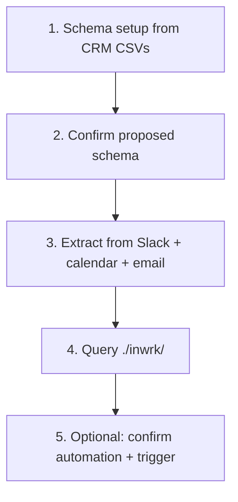

# Continuity sample data

Try the full Continuity loop — **schema discovery → extract → query** — using only files in this folder. No Slack, Google Calendar, CRM connectors, or MCP required.

**Inputs only.** Running the skill creates `./inwrk/` in your workspace. This repo does not ship a pre-built bundle.

## Scenario

**Northwind Analytics** is a small B2B SaaS sales team. Sample sources mirror how data actually shows up:

| Source | Path | Used for |
|--------|------|----------|
| CRM export | `sources/crm/*.csv` | Schema setup (objects, fields, relationships) |
| Slack thread | `sources/slack/sales-team-thread.txt` | Primary extract transcript |
| Calendar | `sources/calendar/events.ics` | Grounding during extract |
| Email | `sources/email/acme-follow-up.txt` | Grounding during extract |

Shared entity names (Acme Corp, deal D101, Priya Sharma) link across sources so identity and cross-source merge behave realistically.

**Transcript anchor date:** `2026-07-11`

## What you need

- Continuity skill installed ([README](../README.md))
- An agent with file access (Cursor, Claude Code, Codex, etc.)
- A workspace directory where `./inwrk/` can be created

**Tip:** Use a playground folder if you do not want `./inwrk/` in the skill repo root:

```bash
mkdir -p ~/continuity-playground && cd ~/continuity-playground
# Point prompts at absolute paths to this sample/ folder, or copy sample/ here
```

## Walkthrough



### Step 1 — Discover schema (CRM)

Paste into your agent (adjust paths if not in the continuity repo):

```
continuity setup — discover schema from sample/sources/crm/*.csv and write to ./inwrk
```

The agent should profile `companies.csv`, `deals.csv`, and `contacts.csv`, then propose objects such as **Company**, **Contact**, and **Deal** with relationships and dedup rules. Review the proposal and confirm.

**Expected output:** `inwrk/schema.md`, `inwrk/schema/v1.md`, synced `inwrk/index.md`

### Step 2 — Extract records (Slack + grounding)

After schema is confirmed:

```
continuity — extract records from sample/sources/slack/sales-team-thread.txt;
ground with sample/sources/calendar/events.ics and sample/sources/email/acme-follow-up.txt;
output to ./inwrk
```

**What to expect:**

- **Deal** updates or new records for Acme (D101, D107) and other pipeline mentions
- **Task**-like work items (demo prep, security questionnaire, pricing deck)
- **Appointment** / **Meeting** from calendar and email (Acme demo Thursday 2pm, Umbrella timeline call)
- **Schema misfits** in the run summary for facts outside your confirmed schema — e.g. "ship without feature flag" (Decision), "blocked on API keys" (Blocker), "warranty claim #8821" — if those object types were not included at setup

Misfits are intentional: they show how Continuity flags gaps instead of forcing data into wrong fields.

### Step 3 — Query your bundle

```
What open tasks and deals mention Acme in inwrk/?
```

```
What meetings are scheduled in inwrk/?
```

```
What schema misfits were flagged in the latest run?
```

### Step 4 — Add an automation (optional)

After extract has produced Deal records:

```
Add an automation: when a Deal status changes to Won, create a Task titled
"Send invoice for {{title}}" with status New, and notify me.
```

Confirm the draft when the agent presents it. The rule is written to `inwrk/automations.md` with `status: confirmed`.

Then mark a deal Won (via a second extract, canvas edit + Apply, or ask the agent to update the Deal):

```
Update the Acme deal in inwrk/ to status Won
```

**What to expect:**

- A `record.updated` line in `inwrk/events.jsonl` with `changes.status.to: Won`
- Automation fires → new Task record + entry in `notifications.md`
- Chat summary lists the automation fired
- Say **visualize** to see the Activity feed and Automations panel on the canvas

External actions (email / message via MCP) are always proposed for your approval — they never auto-send.

### Step 5 — Re-run (optional)

Run Step 2 again with the same sources. The agent should **update** existing records (same Acme deal, same demo task) using identity/dedup rules from your schema rather than duplicating everything. Confirmed automations evaluate again only for **new** events after the cursor (no duplicate invoice tasks from the same Won transition).

## Source file reference

### CRM (`sources/crm/`)

- **companies.csv** — `company_id`, `name`, `domain`, `industry`
- **deals.csv** — `deal_id`, `name`, `company_name`, `amount`, `status`, `close_date` (statuses: New, Qualified, Won, Lost)
- **contacts.csv** — `contact_id`, `name`, `email`, `company_name`, `title`

### Slack (`sources/slack/sales-team-thread.txt`)

Slack-style export with timestamps and @mentions. Covers pipeline updates, action items, a product decision, an infra blocker, and a warranty claim outside the CRM schema.

### Calendar (`sources/calendar/events.ics`)

Standard iCalendar with three events: Acme client demo (Thu 2026-07-16 14:00 UTC), daily standup, Umbrella migration timeline review.

### Email (`sources/email/acme-follow-up.txt`)

Two-message thread with Priya Sharma confirming Thursday demo, combined pricing ask, feature-flag note, and warranty claim called out separately.

## Troubleshooting

| Issue | What to do |
|-------|------------|
| Agent uses default 9 types instead of CRM schema | Run setup first; confirm schema before extract |
| No `./inwrk/` created | Check workspace path; ensure agent has write access |
| Everything becomes a Task | Schema may be too narrow — add Task, Meeting, or Decision at setup or approve a schema proposal after misfits |
| Duplicate records on re-run | Confirm dedup rules in `schema.md`; prior `records/index.md` must load before extract |

## Next steps

- Add your own CSV exports to `sources/crm/` and re-run setup
- Replace Slack/calendar/email files with real exports (same folder layout)
- Approve schema proposals when recurring misfits appear in `inwrk/runs/`
- Add automations (`when X happens do Y`) and say **visualize** for the Activity feed

See [SKILL.md](../SKILL.md), [references/schema-setup.md](../references/schema-setup.md), and [references/automations.md](../references/automations.md) for full workflow details.
